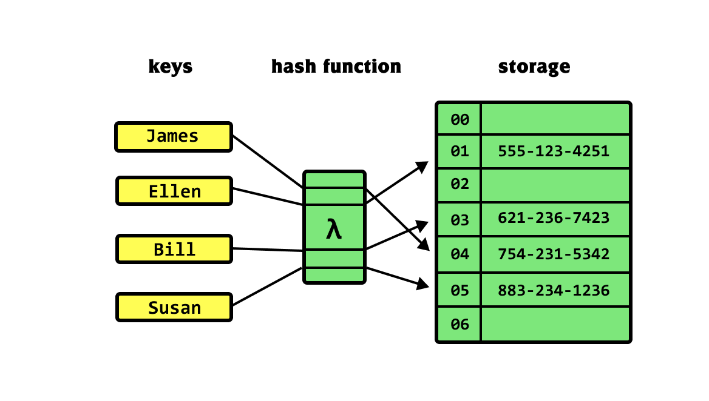

# Hash tables

A hash table uses a hash function to compute an index, also called a hash code, into an array of buckets or slots, from which the desired value can be found. During lookup, the key is hashed and the resulting hash indicates where the corresponding value is stored.

## Collision handling 

If we are using more than 20 randomly generated key values, then the likelihood of collision will be more than 40%. 
Check the *von Mises birthday paradox* for more information about this phenomenon. Hence, a collision resolution method must
be implemented. There are two main types of resolution methods, either **separate chaining** or **open addressing**. 
In this implementation, separate chaining will be used. This method requires another data structure, preferably dynamically
addressable, like a linked list or a self-balanced tree.

